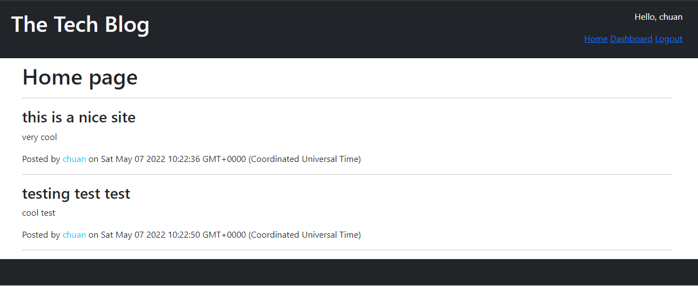

# tech-blog
## Description
This is a simple site for blogging. 
User can signup/login. 
Login session persists for 2 hours. 
Without logging in you can view blogs and comments. 
Click on blog to view comments. 
While logged in you can post new blogs and comments on other blogs. 
You can edit your past post in dashboard. 

## Deployed Link
https://secret-atoll-57844.herokuapp.com/

## Screen shots

## Table of Contents
- [Installation](#installation)
- [Usage](#usage)
- [Contribution](#contribution)
- [Test](#test)
- [License](#license)
- [GitHub](#github)
- [Contact](#contact)

## Installation
Type "npm install" in terminal to install dependencies, required for this program to work 
Type "npm run resetdb" and enter password to set up database 
Optional "npm run seed" to seed a bit of sample data 
Or just go to deployed site, no need for install 

## Usage
type "npm start" in terminal to run server, go to http://localhost:3000 to view the site 
alternatively just go to deployed link

## Contribution
No need for contribution, solo project.

## Test
Install then use

## License
This project is licensed with MIT License. 

## GitHub
https://github.com/chuanw101

## Contact
- Author: Chuan Wang
- Email: chuan.wang101@gmail.com
